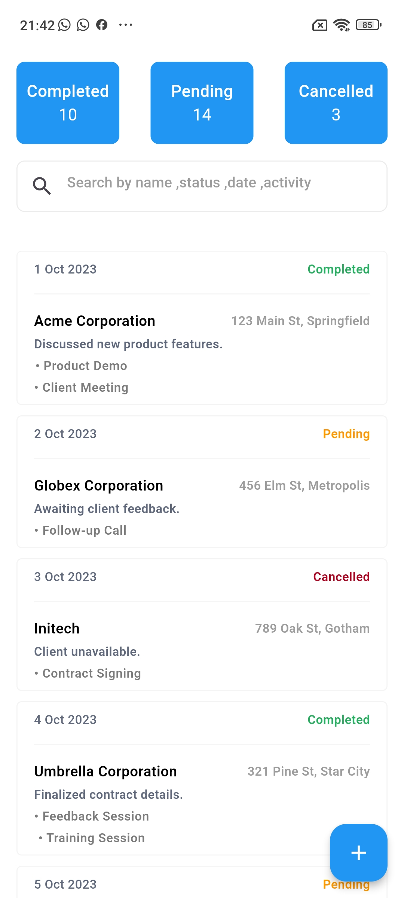
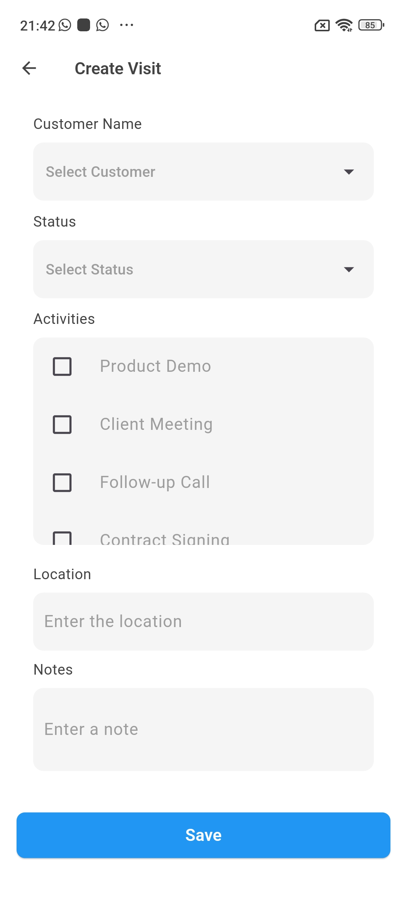

# mini_visits_tracker_app

## Project Structure

```mini_visits_tracker_app/
.
├── android                         - It contains files required to run the application on an Android platform.
├── assets                          - It contains all images and fonts of your application.
├── ios                             - It contains files required to run the application on an iOS platform.
├── lib                             - Most important folder in the application, used to write most of the Dart code..
    ├── main.dart                   - Starting point of the application
    ├── core
    │   ├── app_export.dart         - It contains commonly used file imports
    │   ├── constants               - It contains all constants classes
    │   ├── errors                  - It contains error handling classes                  
    │   ├── network                 - It contains network-related classes
        ├── routes
        ├── themes
        ├── constants
    │   └── utils                   - It contains common files and utilities of the application
    ├── data
    │   ├── apiClient               - It contains API calling methods 
    │   ├── models                  - It contains request/response models 
    │   └── repository              - Network repository
                   
    ├── presentation                - It contains widgets of the screens with their controllers  of the whole application.                                          
    └── widgets                     - It contains all custom widget classes
```
```
# mini_visits_tracker_app

## 📱 App Screenshots

### Home Screen


### Create Visit

